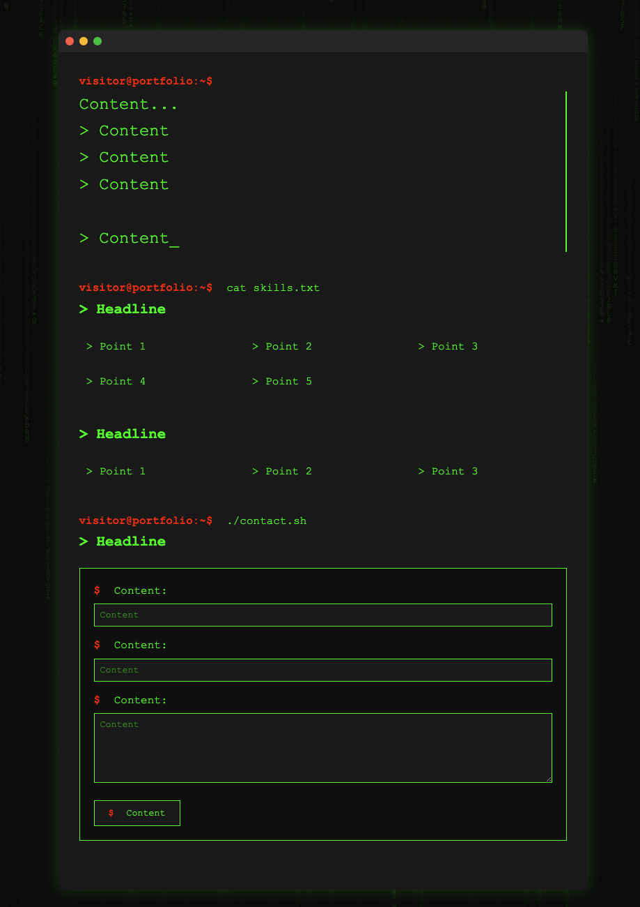

# Terminal-Style Portfolio Template 🖥️

A minimalist, hacker-themed portfolio website template with a terminal-like interface. Perfect for developers who want to showcase their skills in a unique and interactive way.


---

## ✨ Features

- **Terminal-style interface**: Navigate through your portfolio like a command-line pro.
- **Matrix rain background**: Adds a cool hacker vibe to your site.
- **Interactive project showcase**: Display your projects with detailed descriptions.
- **Responsive design**: Works seamlessly on all devices.
- **Contact form with animation**: Engage visitors with a sleek, animated form.
- **Pure HTML, CSS, and JavaScript**: No frameworks, just clean code.

---

## 🖼️ Preview



---

## 🚀 Quick Start

1. **Clone the repository**:
   ```bash
   git clone https://github.com/friedrich-x/terminal-portfolio.git
   cd terminal-portfolio
   ```
2. **Customize the content**:
   - Replace all "Headline" placeholders with your section titles.
   - Replace "Point X" with your actual content.
   - Update "Content" placeholders in forms.
   - Modify project details in `script.js`.

3. **Deploy**:
   - Upload to your web host.
   - Or deploy using GitHub Pages.

---

## 🛠️ Customization

### Adding Projects
Edit the projects section in `script.js`:

```js
const projectData = {
  yourproject: {
    title: "Headline",
    description: "> Point 1\n> Point 2\n> Point 3",
    tech: "> Technologies:\n- Point 1\n- Point 2"
  }
}
```

### Modifying Styles
Customize the terminal theme colors in `style.css`:

- **Background**: `#0a0a0a`
- **Text**: `#00ff00`
- **Accents**: `#ff0000`

---

## 📂 Project Structure
```
terminal-portfolio/
├── index.html          # Main HTML file
├── style.css           # Styles for the portfolio
├── script.js           # JavaScript for interactivity
├── preview.png         # Preview image for the README
└── README.md           # This file
```

---

## 🌐 Browser Support

- Chrome (recommended)
- Firefox
- Safari
- Edge

---

## 📜 License

This project is open source and available under the MIT License.

---

**Made with ⚡ by 3xpl0its**